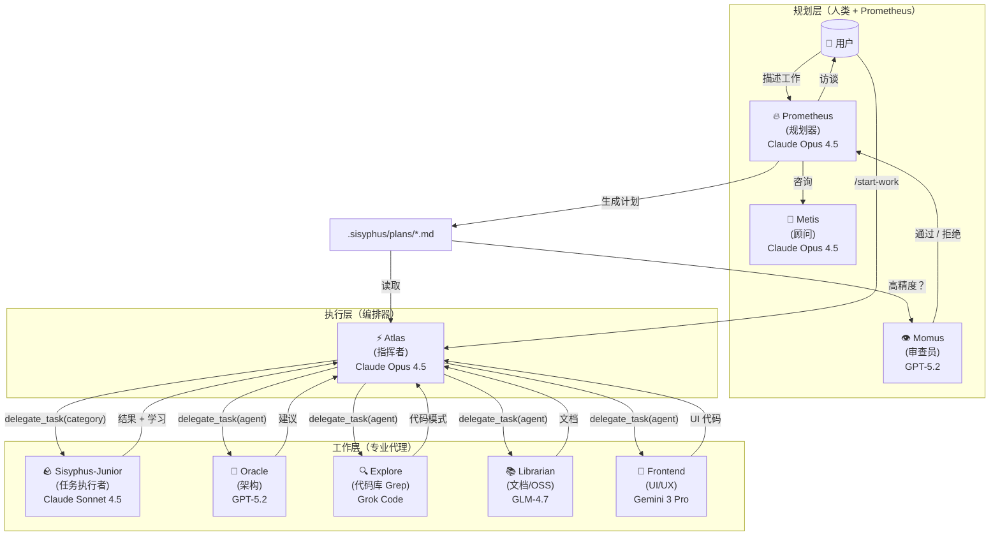
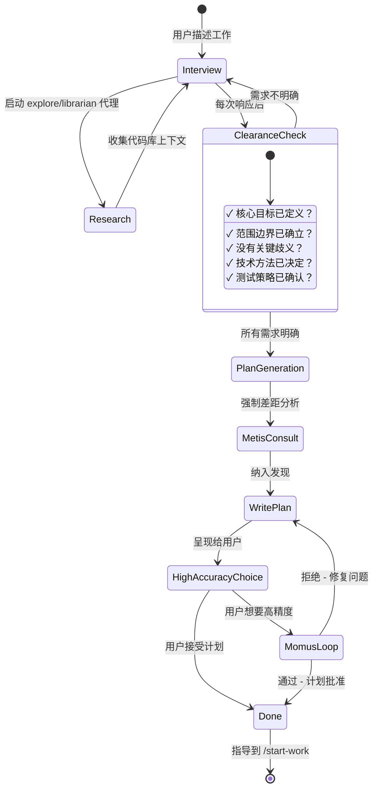
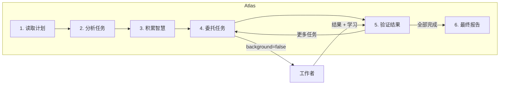
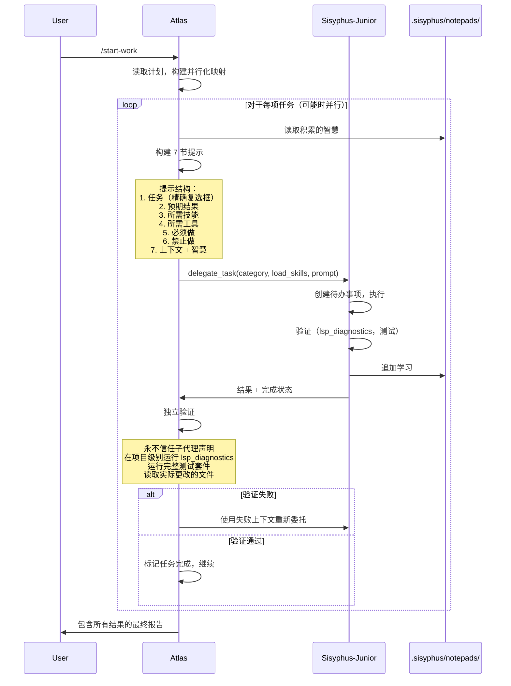

# 理解编排系统

Oh My OpenCode 的编排系统将简单的 AI 代理转变为协调的开发团队。本文档解释了 Prometheus → Atlas → Junior 工作流如何创建高质量、可靠的代码输出。

---

## 核心理念

传统的 AI 编码工具遵循简单的模式：用户请求 → AI 响应。这对小任务有效，但对复杂工作失败，因为：

1. **上下文过载**：大型任务超过上下文窗口
2. **认知漂移**：AI 在任务中途失去对需求的追踪
3. **验证差距**：没有系统化的方法来确保完整性
4. **人类 = 瓶颈**：需要持续的用户干预

编排系统通过**专业化和委托**解决了这些问题。

---

## 三层架构



---

## 第 1 层：规划（Prometheus + Metis + Momus）

### Prometheus：您的战略顾问

Prometheus **不仅仅是规划器** - 它是一个智能访谈者，帮助您思考真正需要什么。

**访谈过程：**



**意图特定策略：**

Prometheus 根据您正在做什么调整其访谈风格：

| 意图 | Prometheus 重点 | 示例问题 |
|--------|------------------|-------------------|
| **重构** | 安全 - 行为保留 | "什么测试验证当前行为？""回滚策略？" |
| **从头构建** | 发现 - 首先模式 | "在代码库中找到模式 X。遵循它还是偏离？" |
| **中型任务** | 护栏 - 精确边界 | "什么必须不包括？硬约束？" |
| **架构** | 战略 - 长期影响 | "预期寿命？规模要求？" |

### Metis：差距分析器

在 Prometheus 编写计划之前，**Metis 捕获 Prometheus 遗漏的内容**：

- 用户请求中的隐藏意图
- 可能使实现脱轨的歧义
- AI 陈词滥调模式（过度工程、范围蔓延）
- 缺少的验收标准
- 未解决的边缘情况

**为什么 Metis 存在：**

计划作者（Prometheus）有"ADHD 工作记忆" - 它建立了从未写到纸上的连接。Metis 强制隐性知识的外部化。

### Momus：无情的审查员

对于高精度模式，Momus 根据**四个核心标准**验证计划：

1. **清晰度**：每项任务是否指定在哪里找到实现细节？
2. **验证**：验收标准是否具体和可衡量？
3. **上下文**：是否有足够的上下文在不超过 10% 猜测的情况下继续？
4. **大局**：目的、背景和工作流程是否清晰？

**Momus 循环：**

Momus 仅在以下情况下说"通过"：
- 100% 的文件引用已验证
- ≥80% 的任务有明确的参考来源
- ≥90% 的任务有具体的验收标准
- 零任务需要关于业务逻辑的假设
- 零个关键红旗

如果拒绝，Prometheus 修复问题并重新提交。**没有最大重试限制。**

---

## 第 2 层：执行（Atlas）

### 指挥者心态

编排器就像管弦乐队指挥：**它不演奏乐器，它确保完美的和谐**。



**编排器可以做什么：**
- ✅ 读取文件以理解上下文
- ✅ 运行命令验证结果
- ✅ 使用 lsp_diagnostics 检查错误
- ✅ 使用 grep/glob/ast-grep 搜索模式

**编排器必须委托什么：**
- ❌ 写入/编辑代码文件
- ❌ 修复错误
- ❌ 创建测试
- ❌ Git 提交

### 智慧积累

编排的力量在于**累积学习**。每项任务后：

1. 从子代理的响应中提取学习
2. 分类为：约定、成功、失败、陷阱、命令
3. 传递给所有后续子代理

这防止了重复错误并确保一致的模式。

**记事本系统：**

```
.sisyphus/notepads/{计划名称}/
├── learnings.md      # 模式、约定、成功方法
├── decisions.md      # 架构选择和理由
├── issues.md         # 遇到的问题、阻碍、陷阱
├── verification.md   # 测试结果、验证结果
└── problems.md       # 未解决的问题、技术债务
```

### 并行执行

独立任务并行运行：

```typescript
// 编排器从计划中识别可并行化组
// 组 A：任务 2、3、4（无文件冲突）
delegate_task(category="ultrabrain", prompt="任务 2...")
delegate_task(category="visual-engineering", prompt="任务 3...")
delegate_task(category="general", prompt="任务 4...")
// 所有同时运行
```

---

## 第 3 层：工作者（专业代理）

### Sisyphus-Junior：任务执行者

Junior 是实际编写代码的**主力**。关键特征：

- **专注**：无法委托（被阻止使用 task/delegate_task 工具）
- **有纪律**：强迫性待办事项跟踪
- **已验证**：完成前必须通过 lsp_diagnostics
- **受限**：无法修改计划文件（只读）

**为什么 Sonnet 足够：**

Junior 不需要最聪明 - 它需要可靠。通过：
1. 来自编排器的详细提示（50-200 行）
2. 向前传递的积累智慧
3. 明确的必须做 / 禁止做约束
4. 验证要求

即使是中级模型也能精确执行。智能在**系统**中，而不是个别代理中。

### 系统提醒机制

钩子系统确保 Junior 永不中途停止：

```
[系统提醒 - 待办事项继续]

您有未完成的待办事项！在响应前完成所有：
- [ ] 实现用户服务 ← 进行中
- [ ] 添加验证
- [ ] 编写测试

在所有待办事项标记为已完成之前不要响应。
```

这个"推石上山"机制是系统以 Sisyphus 命名的原因。

---

## delegate_task 工具：类别 + 技能系统

### 为什么类别是革命性的

**模型名称的问题：**

```typescript
// 旧：模型名称创建分布偏差
delegate_task(agent="gpt-5.2", prompt="...")  // 模型知道其限制
delegate_task(agent="claude-opus-4.5", prompt="...")  // 不同的自我认知
```

**解决方案：语义类别：**

```typescript
// 新：类别描述意图，而不是实现
delegate_task(category="ultrabrain", prompt="...")     // "战略思考"
delegate_task(category="visual-engineering", prompt="...")  // "设计精美"
delegate_task(category="quick", prompt="...")          // "快速完成"
```

### 内置类别

| 类别 | 模型 | 何时使用 |
|----------|-------|-------------|
| `visual-engineering` | Gemini 3 Pro | 前端、UI/UX、设计、样式、动画 |
| `ultrabrain` | GPT-5.2 Codex（xhigh） | 深度逻辑推理、复杂架构决策 |
| `artistry` | Gemini 3 Pro（max） | 高度创意/艺术任务、新颖想法 |
| `quick` | Claude Haiku 4.5 | 琐碎任务 - 单文件更改、拼写错误修复 |
| `unspecified-low` | Claude Sonnet 4.5 | 不适合其他类别的任务，低工作量 |
| `unspecified-high` | Claude Opus 4.5（max） | 不适合其他类别的任务，高工作量 |
| `writing` | Gemini 3 Flash | 文档、散文、技术写作 |

### 自定义类别

您可以定义自己的类别：

```json
// .opencode/oh-my-opencode.json
{
  "categories": {
    "unity-game-dev": {
      "model": "openai/gpt-5.2",
      "temperature": 0.3,
      "prompt_append": "您是 Unity 游戏开发专家..."
    }
  }
}
```

### 技能：领域特定指令

技能将专业指令预置到子代理提示中：

```typescript
// 类别 + 技能组合
delegate_task(
  category="visual-engineering", 
  load_skills=["frontend-ui-ux"],  // 添加 UI/UX 专长
  prompt="..."
)

delegate_task(
  category="general",
  load_skills=["playwright"],  // 添加浏览器自动化专长
  prompt="..."
)
```

**示例演变：**

| 之前 | 之后 |
|--------|-------|
| 硬编码：`frontend-ui-ux-engineer`（Gemini 3 Pro） | `category="visual-engineering" + load_skills=["frontend-ui-ux"]` |
| 一刀切 | `category="visual-engineering" + load_skills=["unity-master"]` |
| 模型偏差 | 基于类别：模型抽象消除偏差 |

---

## 编排器 → Junior 工作流



---

## 为什么此架构有效

### 1. 关注点分离

- **规划**（Prometheus）：高推理、访谈、战略思考
- **编排**（Atlas）：协调、验证、智慧积累
- **执行**（Junior）：专注实现，无分心

### 2. 显式优于隐式

每个 Junior 提示包括：
- 计划中的确切任务
- 明确的成功标准
- 禁止的操作
- 所有积累的智慧
- 带行号的参考文件

没有假设。没有猜测。

### 3. 信任但验证

编排器**永不信任子代理声明**：
- 在项目级别运行 `lsp_diagnostics`
- 执行完整测试套件
- 读取实际文件更改
- 交叉引用需求

### 4. 模型优化

昂贵的模型（Opus、GPT-5.2）仅在需要时使用：
- 规划决策（每个项目一次）
- 调试咨询（罕见）
- 复杂架构（罕见）

批量工作由成本效益高的模型（Sonnet、Haiku、Flash）完成。

---

## 入门

1. **进入 Prometheus 模式**：在提示符处按 **Tab**
2. **描述您的工作**："我想向我的应用添加用户身份验证"
3. **回答访谈问题**：Prometheus 会询问有关模式、偏好、约束的问题
4. **审查计划**：检查 `.sisyphus/plans/` 中生成的工作计划
5. **运行 `/start-work`**：编排器接管
6. **观察**：观看任务完成并验证
7. **完成**：所有待办事项完成，代码已验证，准备发布

---

## 进一步阅读

- [概述](./overview.zh-CN.md) - 快速入门指南
- [Ultrawork 宣言](../ultrawork-manifesto.zh-CN.md) - 系统背后的理念
- [安装指南](./installation.zh-CN.md) - 详细安装说明
- [配置](../configurations.zh-CN.md) - 自定义编排
