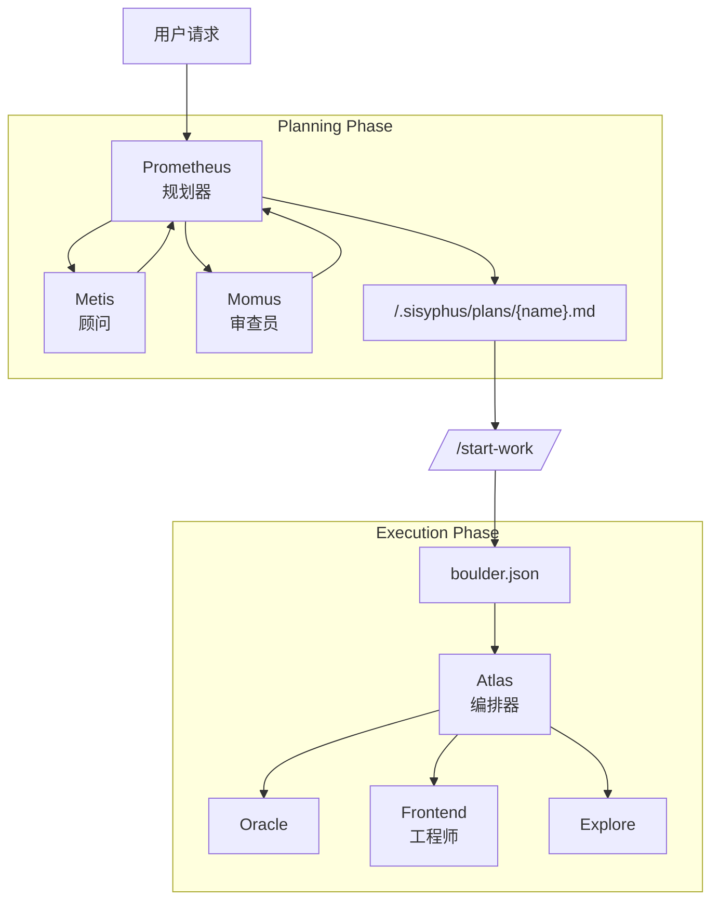

# Oh-My-OpenCode 编排指南

## TL;DR - 何时使用什么

| 复杂度 | 方法 | 何时使用 |
|------------|----------|-------------|
| **简单** | 只是提示 | 简单任务、快速修复、单文件更改 |
| **复杂 + 懒惰** | 只需输入 `ulw` 或 `ultrawork` | 解释上下文很繁琐的复杂任务。代理会自行解决。 |
| **复杂 + 精确** | `@plan` → `/start-work` | 需要真正编排的精确、多步骤工作。Prometheus 规划，Atlas 执行。 |

**决策流程：**

```
这是快速修复还是简单任务？
  └─ 是 → 正常提示
  └─ 否  → 解释完整上下文是否繁琐？
             └─ 是 → 输入"ulw"并让代理解决
             └─ 否  → 您需要精确、可验证的执行吗？
                        └─ 是 → 使用 @plan 进行 Prometheus 规划，然后 /start-work
                        └─ 否  → 只使用"ulw"
```

---

本文档提供实现 Oh-My-OpenCode 核心理念的编排系统的全面指南：**"规划和执行分离"**。

## 1. 概述

传统的 AI 代理经常混合规划和执行，导致上下文污染、目标漂移和 AI 陈词滥调（低质量代码）。

Oh-My-OpenCode 通过明确分离两个角色来解决这个问题：

1. **Prometheus（规划器）**：从不编写代码的纯战略家。通过访谈和分析建立完美的计划。
2. **Atlas（执行器）**：执行计划的编排器。将工作委托给专业代理，永不停止直到完成。

---

## 2. 整体架构



---

## 3. 关键组件

### 🔮 Prometheus（规划器）

- **模型**：`anthropic/claude-opus-4-5`
- **角色**：战略规划、需求访谈、工作计划创建
- **约束**：**只读**。只能在 `.sisyphus/` 目录中创建/修改 markdown 文件。
- **特征**：从不直接编写代码，只专注于"如何做"。

### 🦉 Metis（计划顾问）

- **角色**：预分析和差距检测
- **功能**：识别隐藏的用户意图、防止 AI 过度工程、消除歧义。
- **工作流程**：在创建计划之前必须进行 Metis 咨询。

### ⚖️ Momus（计划审查员）

- **角色**：高精度计划验证（高精度模式）
- **功能**：拒绝并要求修订直到计划完美。
- **触发器**：当用户请求"高精度"时激活。

### ⚡ Atlas（计划执行器）

- **模型**：`anthropic/claude-opus-4-5`（扩展思考 32k）
- **角色**：执行和委托
- **特征**：不直接做所有事情，积极委托给专业代理（Frontend、Librarian 等）。

---

## 4. 工作流程

### 阶段 1：访谈和规划（访谈模式）

Prometheus 默认以**访谈模式**开始。它不是立即创建计划，而是收集足够的上下文。

1. **意图识别**：分类用户的请求是重构还是新功能。
2. **上下文收集**：通过 `explore` 和 `librarian` 代理调查代码库和外部文档。
3. **草稿创建**：在 `.sisyphus/drafts/` 中持续记录讨论内容。

### 阶段 2：计划生成

当用户请求"将其制定为计划"时，计划生成开始。

1. **Metis 咨询**：确认任何遗漏的需求或风险因素。
2. **计划创建**：在 `.sisyphus/plans/{name}.md` 文件中编写单个计划。
3. **交接**：计划创建完成后，指导用户使用 `/start-work` 命令。

### 阶段 3：执行

当用户输入 `/start-work` 时，执行阶段开始。

1. **状态管理**：创建 `boulder.json` 文件以跟踪当前计划和会话 ID。
2. **任务执行**：Atlas 读取计划并逐一处理待办事项。
3. **委托**：UI 工作委托给 Frontend 代理，复杂逻辑委托给 Oracle。
4. **连续性**：即使会话中断，工作也会通过 `boulder.json` 在下一个会话中继续。

---

## 5. 命令和用法

### `@plan [请求]`

调用 Prometheus 开始规划会话。

- 示例：`@plan "我想将身份验证系统重构为 NextAuth"`

### `/start-work`

执行生成的计划。

- 功能：在 `.sisyphus/plans/` 中查找计划并进入执行模式。
- 如果有中断的工作，自动从中断处恢复。

---

## 6. 配置指南

您可以在 `oh-my-opencode.json` 中控制相关功能。

```jsonc
{
  "sisyphus_agent": {
    "disabled": false,           // 启用 Atlas 编排（默认：false）
    "planner_enabled": true,     // 启用 Prometheus（默认：true）
    "replace_plan": true         // 用 Prometheus 替换默认计划代理（默认：true）
  },
  
  // 钩子设置（添加以禁用）
  "disabled_hooks": [
    // "start-work",             // 禁用执行触发器
    // "prometheus-md-only"      // 移除 Prometheus 写入限制（不推荐）
  ]
}
```

## 7. 最佳实践

1. **不要急于求成**：在与 Prometheus 的访谈中投入足够的时间。计划越完美，执行越快。
2. **单一计划原则**：无论任务多大，将所有待办事项包含在一个计划文件（`.md`）中。这可以防止上下文碎片化。
3. **积极委托**：在执行期间，通过 `delegate_task` 委托给专业代理，而不是直接修改代码。
